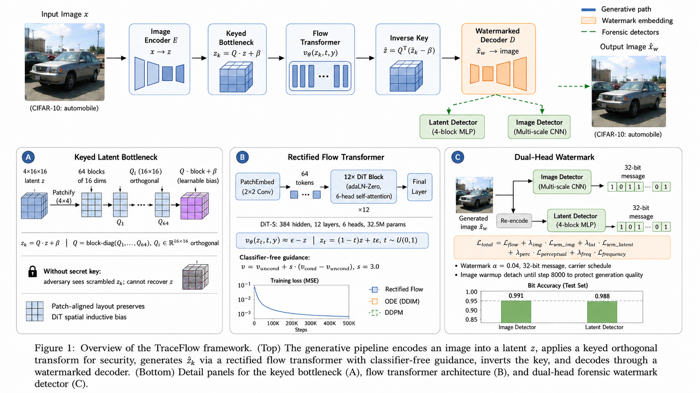
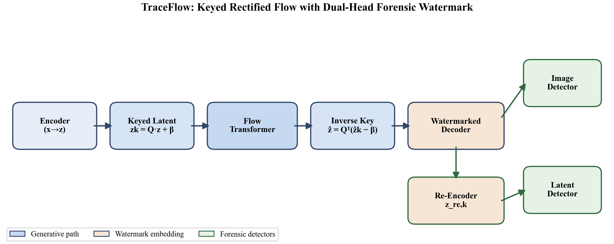
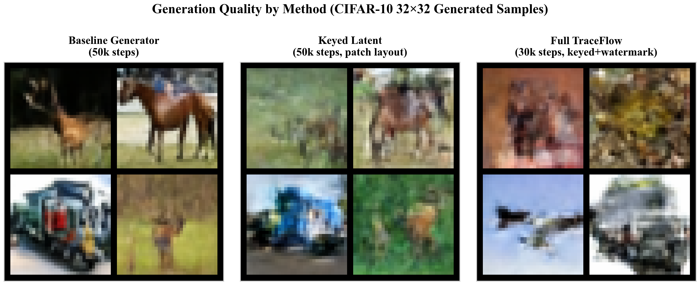
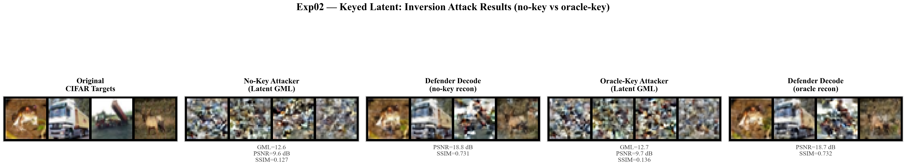
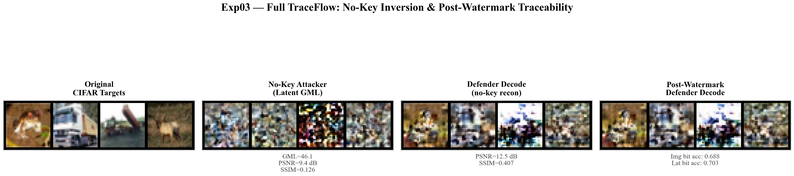
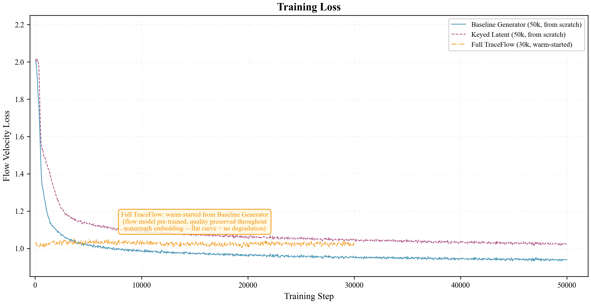
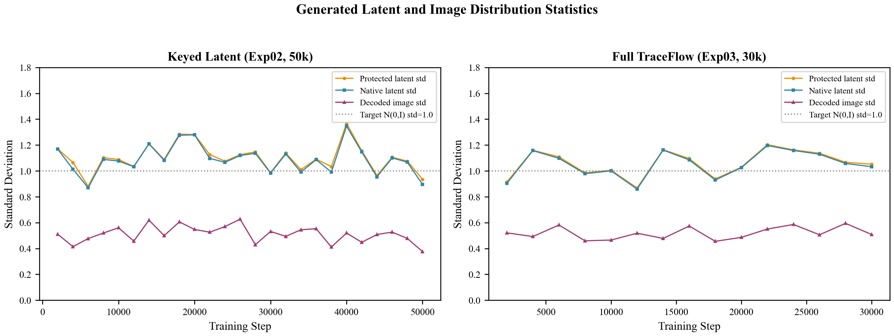
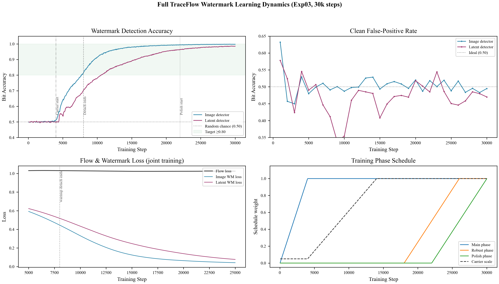
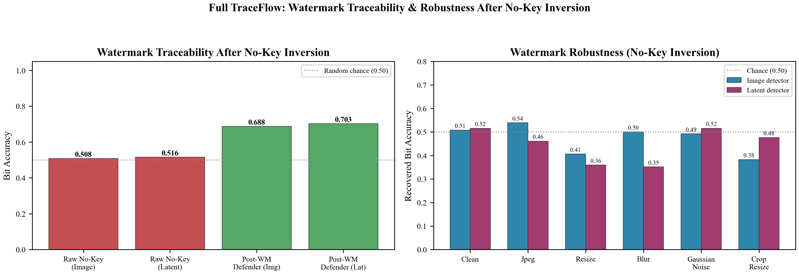

# TraceFlow: Trackable Inversion-Resistant Latent Generation

TraceFlow is a research codebase for **traceable generative image models under inversion attacks**. It combines a compact VAE latent space, a DiT-style rectified-flow generator, a patch-aligned keyed latent bottleneck, and dual-domain watermark detectors so that generated images remain usable while unauthorized latent inversion loses semantic meaning and authorized tracing remains possible.

<p align="center">
  
</p>

<p align="center">
  <b>Keyed latent generation + dual-domain watermark tracing for CIFAR-32 experiments.</b>
</p>

## Highlights

- **Latent DiT generator.** A local VAE compresses CIFAR-10 images into `4 x 16 x 16` latents. A DiT-S rectified-flow model learns generation in this latent space.
- **Patch-aligned keyed bottleneck.** The secret-key transform operates on DiT-aligned `4 x 2 x 2` latent patches instead of flattening rows, preserving generation quality while making no-key inversion semantically weak.
- **Traceable watermarking.** Full TraceFlow jointly trains image-domain and latent-domain watermark detectors with a 32-bit message signal.
- **Ablation-ready experiments.** The repository separates the baseline generator, keyed generator, and full keyed+watermarked TraceFlow runs.

## Paper Figures

The figures below are copied into `docs/readme_assets/` so they remain visible on GitHub even when local experiment folders are ignored.

### Method Pipeline

<p align="center">
  
</p>
<p align="center">
  <sub>Figure 1. TraceFlow pipeline: VAE latent encoding, patch-aligned keyed transform, DiT rectified-flow generation, inverse-key recovery, and dual-domain watermark tracing.</sub>
</p>

### Generation Quality

<p align="center">
  
</p>
<p align="center">
  <sub>Figure 2. CIFAR-32 generation samples from the baseline, keyed, and full TraceFlow settings.</sub>
</p>

### Keyed Inversion Resistance

<p align="center">
  
</p>
<p align="center">
  <sub>Figure 3. Exp02 keyed model: no-key inversion loses semantic content, while defender-side inverse-key decoding remains meaningful.</sub>
</p>

### Full TraceFlow Inversion And Traceability

<p align="center">
  
</p>
<p align="center">
  <sub>Figure 4. Exp03 full TraceFlow: keyed inversion resistance plus post-watermark traceability in image and latent domains.</sub>
</p>

### Training Dynamics

<p align="center">
  
</p>
<p align="center">
  <sub>Figure 5. Rectified-flow training losses for baseline, keyed, and full TraceFlow runs.</sub>
</p>

### Latent Distribution Diagnostics

<p align="center">
  
</p>
<p align="center">
  <sub>Figure 6. Generated protected/native latent statistics and decoded image statistics across training.</sub>
</p>

### Watermark Learning

<p align="center">
  
</p>
<p align="center">
  <sub>Figure 7. Full TraceFlow watermark detector learning curves and training phase schedule.</sub>
</p>

### Traceability And Robustness

<p align="center">
  
</p>
<p align="center">
  <sub>Figure 8. Watermark traceability after no-key inversion and robustness under common image perturbations.</sub>
</p>

## Main Results

| Category | Metric | Exp01 Baseline | Exp02 Keyed | Exp03 Full TraceFlow |
|---|---:|---:|---:|---:|
| Generation | Training steps | 50k | 50k | 30k |
| Generation | Flow loss | 0.9406 | 1.0233 | 1.1402 |
| Autoencoder | PSNR / SSIM | 39.5 / 0.993 | shared | shared |
| Inversion | No-key GML | - | 12.6 | 46.1 |
| Inversion | No-key PSNR / SSIM | - | 9.6 / 0.127 | 9.4 / 0.126 |
| Inversion | Defender PSNR / SSIM | - | 18.8 / 0.731 | 12.5 / 0.407 |
| Watermark | Raw no-key image bit acc | n/a | n/a | 0.5078 |
| Watermark | Post-WM image bit acc | n/a | n/a | 0.6875 |
| Watermark | Post-WM latent bit acc | n/a | n/a | 0.7031 |

The full metrics table and exported plotting data are in [`docs/readme_assets/metrics_summary.md`](docs/readme_assets/metrics_summary.md) and [`docs/readme_assets/metrics_summary.csv`](docs/readme_assets/metrics_summary.csv).

## Method Overview

### 1. Local VAE Latent Space

TraceFlow first trains a project-native VAE on CIFAR-10 at `32 x 32` resolution. The VAE maps each image `x` to a compact latent tensor `z` with shape `4 x 16 x 16`.

The VAE is trained with reconstruction loss plus KL regularization:

```text
z = mu + exp(0.5 * logvar) * eps
L_ae = L_recon(x_hat, x) + beta * KL(q(z|x) || N(0, I))
```

For downstream generator training, the encoder uses deterministic `mu` latents and stores per-channel latent statistics for stable normalized decoding.

### 2. DiT Rectified-Flow Generator

The generator is a DiT-S style transformer operating on latent patches. With `latent_size=16` and `patch_size=2`, each latent is represented as `8 x 8 = 64` tokens.

TraceFlow uses the rectified-flow convention:

```text
z_t = (1 - t) * z_data + t * eps
v*  = eps - z_data
L_flow = ||v_theta(z_t, t, y) - v*||^2
```

Sampling starts from Gaussian noise at `t=1` and integrates the predicted velocity backward to `t=0`. Classifier-free guidance is used during sampling.

### 3. Patch-Aligned Keyed Bottleneck

The keyed transform is the core protection layer for inversion resistance. Instead of applying a secret transform over flattened latent rows, TraceFlow applies key-derived orthogonal transforms over DiT-aligned latent patches:

```text
latent patch block = C x p x p = 4 x 2 x 2 = 16 dimensions
z_keyed = Q_key * z_patch + b_key
z_native = Q_key^-1 * (z_keyed - b_key)
```

This preserves the generator's spatial token structure while preventing no-key inversion from recovering semantic latents. Authorized decoding applies the inverse key before VAE decoding.

### 4. Dual-Domain Watermarking

The full TraceFlow experiment adds a watermark adapter and two detectors:

- **Image-domain detector:** traces watermark bits from decoded images.
- **Latent-domain detector:** traces watermark bits from protected or recovered latents.

The full objective combines generation quality, watermark accuracy, and preservation terms:

```text
L = L_flow
  + lambda_wm_img    * L_bits_img
  + lambda_wm_latent * L_bits_latent
  + lambda_img       * L_image_preserve
  + lambda_cycle     * L_cycle
  + lambda_residual  * L_residual
  + lambda_perc      * L_perceptual
  + lambda_freq      * L_frequency
```

The current CIFAR-32 full run demonstrates traceability, but the 30k watermarked model can show visible watermark artifacts. This is reported as a limitation; a frequency-domain or DWT embedding variant is a natural next step.

## Experiment Map

| Experiment | Purpose | Default entry |
|---|---|---|
| Exp01 Baseline | Pure latent generator | `train-generator` |
| Exp02 Keyed | Secret-key generation and no-key inversion failure | `train-keyed` |
| Exp03 Full TraceFlow | Keyed generation plus image/latent watermark tracing | `train-final` |

## Repository Layout

```text
configs/traceflow_cifar32.yml       CIFAR-32 paper configuration
src/models/flow_transformer.py      DiT-style latent transformer
src/generation/rectified_flow.py    Rectified-flow losses and samplers
src/security/keyed_bottleneck.py    Flat and patch-aligned keyed transforms
scripts/traceflow.py                Single-entry experiment runner
scripts/train_flow_transformer.py   Generator/keyed/full training loop
scripts/pretrain_autoencoder.py     Local VAE pretraining
PAPER_FIGURES/                      Paper-ready figures and summary tables
```

## Setup

```bash
git clone <your-repo-url> TraceFlow
cd TraceFlow

conda create -n traceflow-cuda python=3.11 -y
conda activate traceflow-cuda
pip install -r requirements.txt
```

The current paper configuration targets a single CUDA GPU and native CIFAR-10 download through torchvision.

## Quickstart

### 1. Train the local VAE

```bash
AE_BUNDLE=runs/cifar32_vae_ae

python -m scripts.traceflow train-autoencoder \
  --config configs/traceflow_cifar32.yml \
  --bundle-dir "$AE_BUNDLE" \
  --foreground
```

After training, use:

```bash
AE="$AE_BUNDLE/checkpoints/autoencoder/latest.pt"
```

### 2. Exp01: train the baseline generator

```bash
GEN_BUNDLE=runs/exp01_baseline_50k

python -m scripts.traceflow train-generator \
  --config configs/traceflow_cifar32.yml \
  --bundle-dir "$GEN_BUNDLE" \
  --set autoencoder.checkpoint_path="$AE" \
  --set training.num_steps=50000 \
  --foreground
```

### 3. Exp02: train the keyed generator

```bash
KEYED_BUNDLE=runs/exp02_keyed_patch_50k

python -m scripts.traceflow train-keyed \
  --config configs/traceflow_cifar32.yml \
  --bundle-dir "$KEYED_BUNDLE" \
  --set autoencoder.checkpoint_path="$AE" \
  --set security.latent_transform.block_layout=patch \
  --set training.num_steps=50000 \
  --foreground
```

### 4. Exp03: train full TraceFlow

```bash
FULL_BUNDLE=runs/exp03_full_traceflow_30k
KEYED_CKPT="$KEYED_BUNDLE/checkpoints/traceflow-cifar32_lat16_vae-keyed/latest.pt"

python -m scripts.traceflow train-final \
  --config configs/traceflow_cifar32.yml \
  --bundle-dir "$FULL_BUNDLE" \
  --set autoencoder.checkpoint_path="$AE" \
  --set watermark.lambda_wm_latent=0.5 \
  --set training.num_steps=30000 \
  --init-from "$KEYED_CKPT" \
  --foreground
```

## Sampling

```bash
python -m scripts.sample_flow_transformer \
  --config configs/traceflow_cifar32.yml \
  --checkpoint "$GEN_BUNDLE/checkpoints/traceflow-cifar32_lat16_vae-generator/latest.pt" \
  --num-samples 16 \
  --steps 100 \
  --guidance-scale 3.0 \
  --output-dir runs/samples_exp01
```

For keyed models, use the keyed checkpoint and the same config so the transform metadata matches the model.

## Inversion And Traceability Evaluation

Use the inversion evaluation scripts to verify the two central security claims:

1. **Exp02 keyed:** no-key inversion should lose semantic meaning, while defender-side inverse-key recovery remains meaningful.
2. **Exp03 full:** inversion remains semantically weak without the key, while watermark bits remain traceable in image and latent domains.

Example:

```bash
python -m scripts.eval_traceflow_inversion \
  --config configs/traceflow_cifar32.yml \
  --checkpoint "$KEYED_BUNDLE/checkpoints/traceflow-cifar32_lat16_vae-keyed/latest.pt" \
  --output-dir runs/inversion_exp02_keyed
```

Generated inversion summaries can be visualized with the plotting scripts used to produce the paper figures. README-ready figure copies are stored in [`docs/readme_assets/`](docs/readme_assets/).

## Reproducing The Paper Figures

The README-visible figure copies are stored in [`docs/readme_assets/`](docs/readme_assets/). Full local plotting exports may additionally be written to `PAPER_FIGURES/`, which is ignored by git.

```text
fig1_pipeline                         method overview
fig2_generation_samples               baseline/keyed/full generation samples
fig3_training_loss                    training loss curves
fig4_latent_stats                     latent distribution diagnostics
fig5_autoencoder                      VAE reconstruction and prior diagnostics
fig6_watermark_learning               full TraceFlow watermark learning curve
fig7_inversion_exp02_keyed             keyed inversion visual results
fig8_inversion_exp03_full              full TraceFlow inversion visual results
fig9_inversion_quality_bars            inversion metric comparison
fig10_watermark_traceability_robustness watermark traceability metrics
```

## Lessons From Debugging

Several issues were resolved during development and are reflected in the current code:

- Deterministic AE latents alone were not enough; VAE posterior sampling and latent statistics were needed for stable generator training.
- Raw `decode(N(0,I))` was not the right diagnostic path; flow-normalized prior decoding must use stored latent statistics.
- DiT timestep embeddings require timestep-like scale, so `time_scale=1000.0` is used.
- A mixed-high rectified-flow objective improved some probes but hurt full sampling, so the final CIFAR-32 runs use uniform `t`.
- The original flat keyed transform scrambled latent rows and produced color-noise samples. The current patch-aligned keyed transform fixes this by matching the DiT patch layout.

## Limitations

- Current released results are CIFAR-10 at `32 x 32`; larger-image experiments require retuning model size, VAE, and watermark strength.
- The 30k full TraceFlow watermark run shows visible artifacts. Future work should explore frequency-domain or DWT-style embedding for better invisibility.
- Quantitative perceptual metrics should be extended with larger sample counts before making strong claims about generation quality.

## Citation

If you use this codebase or figures, please cite the project once the paper metadata is finalized:

```bibtex
@misc{traceflow2026,
  title        = {TraceFlow: Trackable Inversion-Resistant Latent Generation},
  author       = {Anonymous},
  year         = {2026},
  howpublished = {GitHub repository}
}
```
